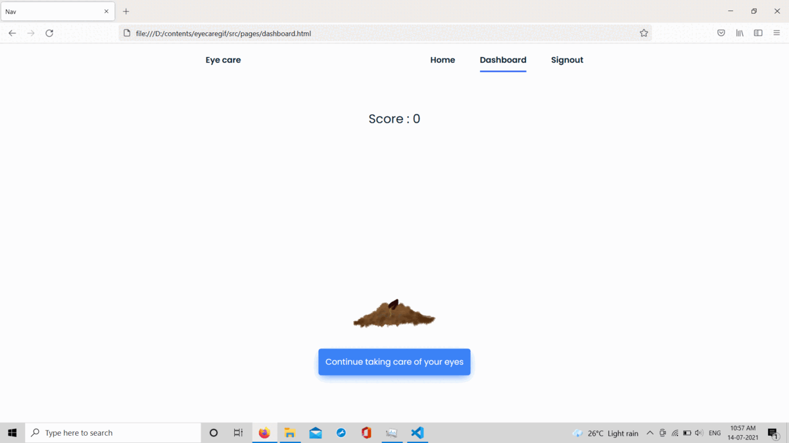

# Eye Care App

*Eye Care* will help you to take care of your eyes.


## The problem:
Nowadays, everyone has very high screen time which may lead to eye strain. Eye Care App will help them to take care of their eyes by following the simple 20-20-20 rule.

## The solution:
### Following the 20-20-20 rule
- The 20-20-20 rule can help to relax our eyes.
- This rule says that for every 20 minutes spent looking at a screen, a person should look at something 20 feet away for 20 seconds. This should reduce the eye strain caused by looking at digital screens for too long.
- Eye care will remind the user every 20 minutes to take a break for 20 seconds.
### Gamification for consistency:
The main challenge is to stay disciplined, for that:
- This app will plant a flower
- Every time eye care reminds you, you should follow the rule
- The more you stay disciplined, your flower will bloom happily.

## Features
- Reminders for exercise
- Score system
- Gamification by using a flower growth character


## Tech and Tools used:🛠
- ```HTML, CSS, JavaScript``` for building the frontend.
- ```Netlify``` for deploying the frontend app.
- ```Node.js, Express.js, HarperDB``` for building the backend.
- ```Heroku``` for deplying the backend

## Demo snapshots
### Reminder to follow the 20:20:20 rule


### Score based on your discipline
- Every time you follow this rule your score will increase.
- As your score increases, your flower will bloom

